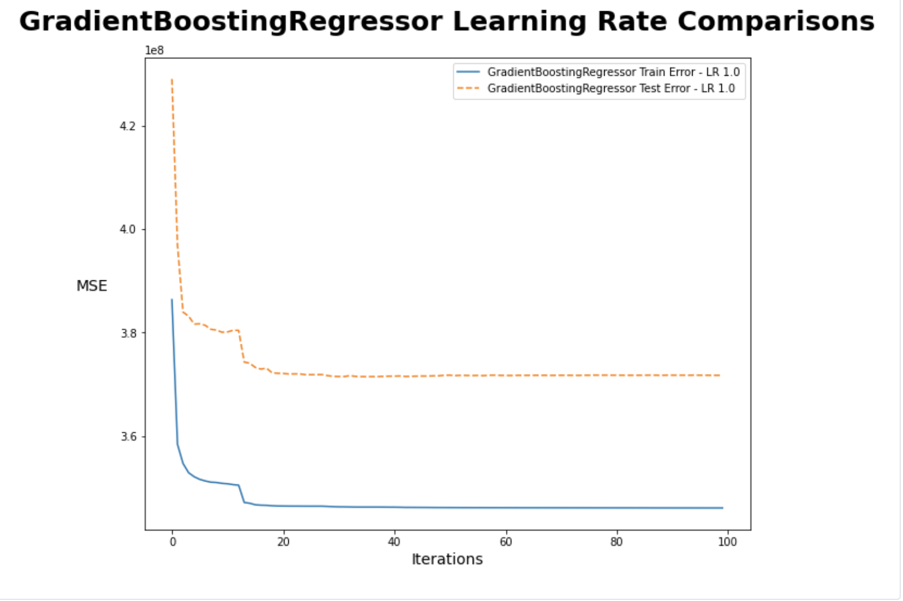
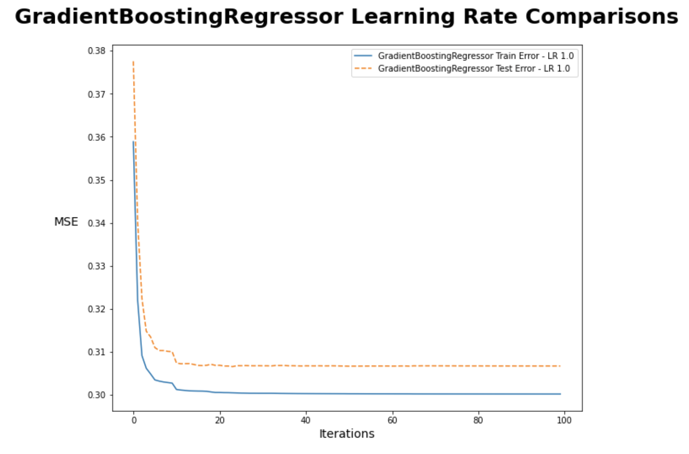
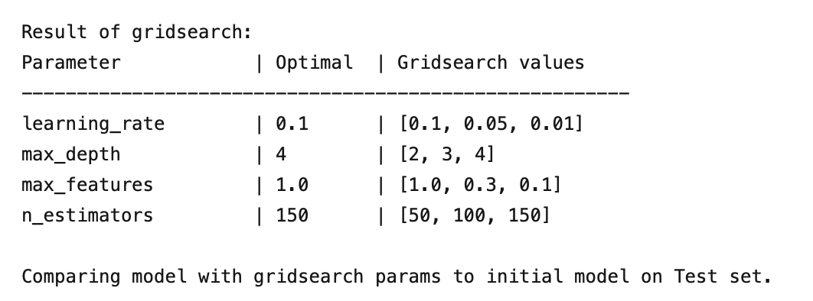
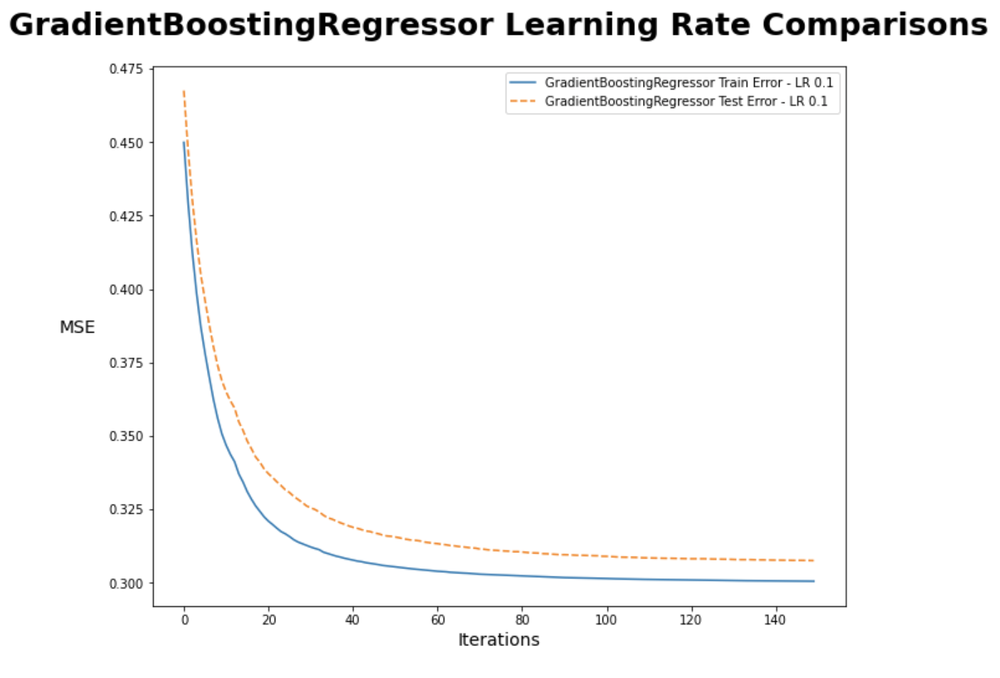
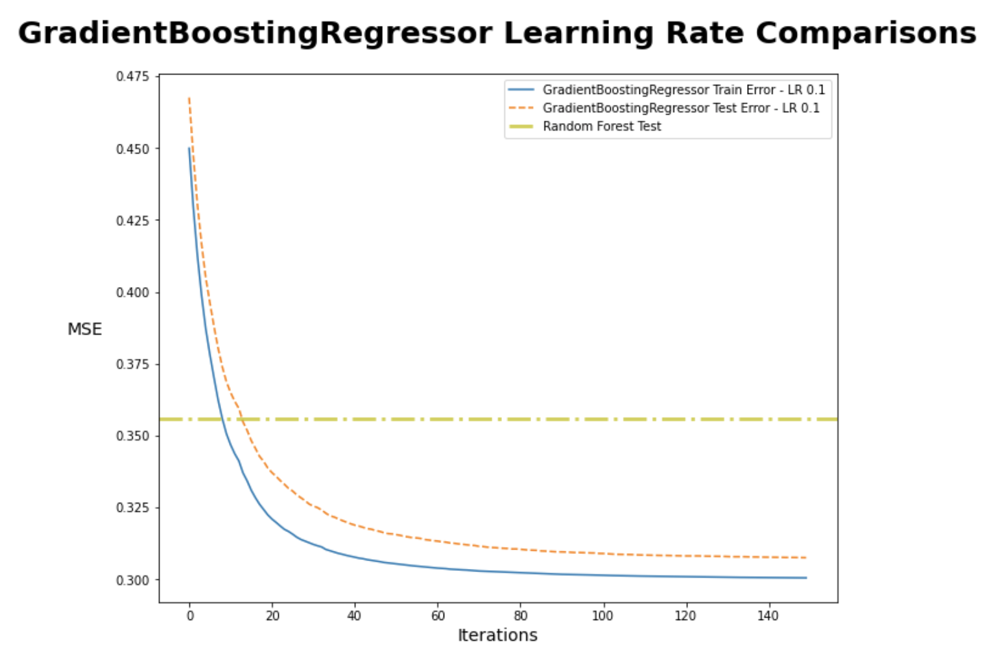

# Regression Case Study
## Data
we isolated our initial analysis to just a few columns:

['Grouser_Type', 'ProductSize', 'Drive_System', 'Thumb', 'Track_Type', 'Pattern_Changer', 'Differential_Type', 'Steering_Controls']

And used One-Hot Encoding to deal with NaNs in the categorical data
## Evaluation
### GDBR Without Log Transform

### GDBR With Log Transform

### Grid Search results for Optimal Hyperparameters GDBR

### Grid Search results for Optimal Hyperparameters Random Forest
.png)
### GDBR With Log Transform and Optimal Hyperparameters

### GDBR vs Random Forest

### Feature Importance

