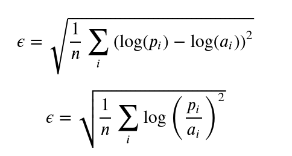

Regression Case Study
======================

In today's exercise you'll get a chance to try some of what you've learned
about supervised learning on a real-world problem.

The goal of the contest is to predict the sale price of a particular piece of
heavy equipment at auction based on its usage, equipment type, and
configuration.  The data is sourced from auction result postings and includes
information on usage and equipment configurations.

Data
======================
The data for this case study are in `./data` in zip files.

## Note: Do not unzip these files.
If you unzip these files, they will be too large to upload to GitHub (unless you
use git LFS). More importantly, pandas can read dataframes from inside zip files
automatically, so there is no need to unzip them at all.

You can read directly from a zip file using:
```
df = pd.read_csv('data/Train.zip')
```

Use `Train.zip` for traning and validation. Don't use the Holdout data until you
have a final model.

The `data_dictionary.csv` file contains some supplementary information you might
be interseted in if you inteded to become an expert in heavy machinery.

Spend some time (but not too much) getting to know the data. You will need a 
strategy for dealing with missing values and categorical values. I encourage  
you to automate that process so you don't need to address each column separately.

Evaluation
======================

The prices of the equipment spans a large range and is not uniformly (or
normally) distributed over that range. This poses the problem with that 
it tends to over-fit on the more expensive equipment. I.e, if you're off 
by 20% for an inexpensive piece of equipment, that might be $20, but for an expensive piece of equipment, that might be $2,000. If using a loss function such as MAE, MSE or RMSE, it will work to reduce the error on the expensive equipment, at the cost of worse predictions on the low price equipment.

To solve this problem, tranform the target column (`'SalePrice'`)  using a log-tranform. This will result in a loss function as shown (if using RMSE):



where *p<sub>i</sub>* are the predicted (unscaled) values and *a<sub>i</sub>* are the (unscaled) target values.

Remember that the difference of two logarithms is the logarithm of the 
*ratio* of the two values, so a 20% difference on a low-price item will 
count the same as a 20% difference on a high-price item.

The downside is that your prediction will now be in units of *log($)*, which
is harder to interpret and compare to validation data, so you will have to
reverse the log-transform to get the final result.


Modeling
============
Remember that of the algorithms we have studied, some are better equipped 
to handle non-linear regression, categorical variables, large numbers of variables and other issues you may encouter. 

You may want to try a variety of models (in an automated way) to compare 
different approaches.


Important Tips
=========================

1. This data is quite messy. Try to use your judgement about where your
cleaning efforts will yield the most results and focus there first.

1. Remember any transformations you apply to the training data will also have
to be applied to the testing data, so plan accordingly.

1. Any transformations of the training data that *learn parameters* (for
example, standardization learns the mean and variance of a feature) must only
use parameters learned from the *training data*.

1. It's possible some columns in the test data will take on values not seen in the training data. Plan accordingly.

1. Start simply. Fit a basic model and make sure you're able to get the
submission working then iterate to improve. Try to develop a model--even if you know it has some weaknesses--within the first two hours.